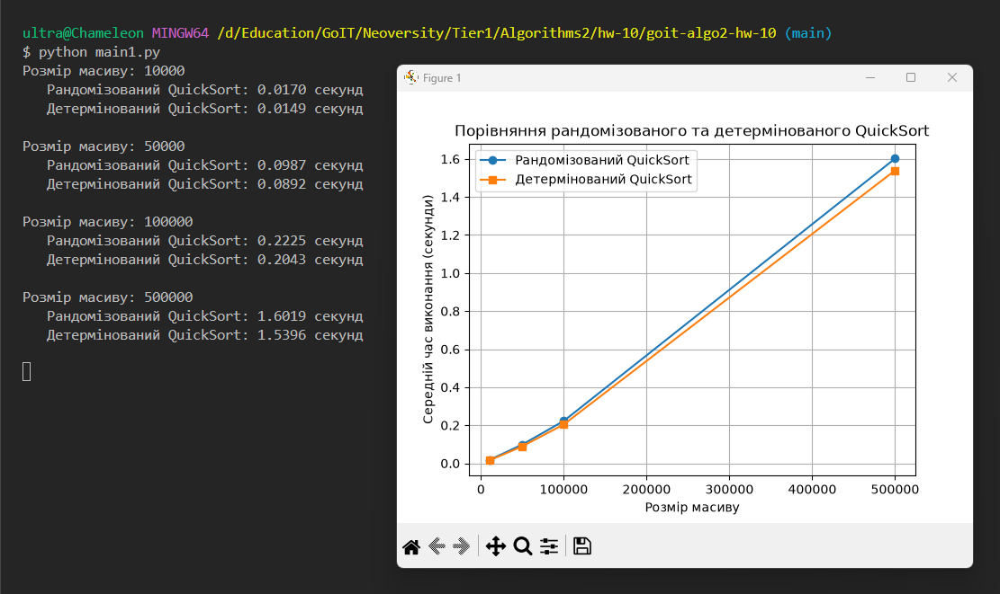
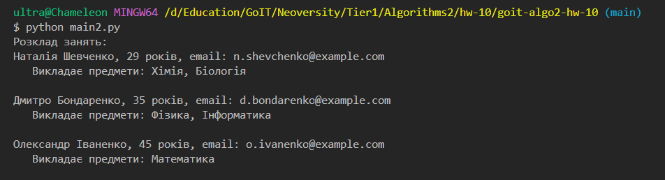

## Встановлення

```bash
pip install poetry
poetry install
```

## Запуск

### Задача 1 — Порівняння рандомізованого та детермінованого QuickSort

```bash
python main1.py
```
### Задача 2 — Складання розкладу занять за допомогою жадібного алгоритму

```bash
python main2.py
```

### Запуск тестів

```bash
python tests.py
```

### Результат

## Задача 1:



## Задача 2:



