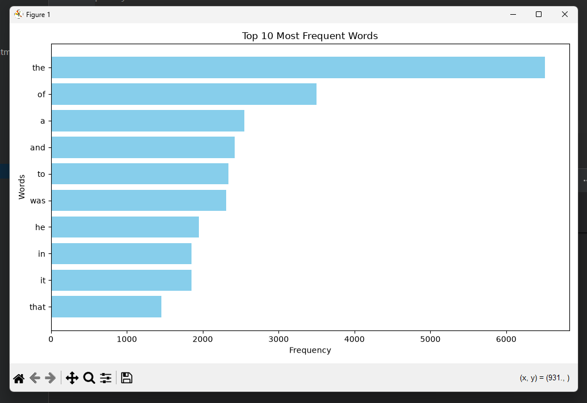

## Встановлення

```bash
pip install poetry
poetry install
```

## Запуск

### Задача 1 — Аналіз частоти використання слів у тексті за допомогою парадигми MapReduce

```bash
python main.py
```

### Запуск тестів

```bash
python test.py
```

## Результат

